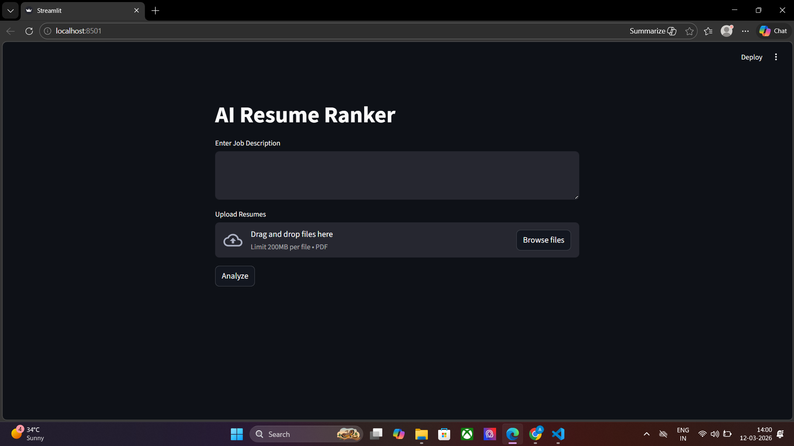
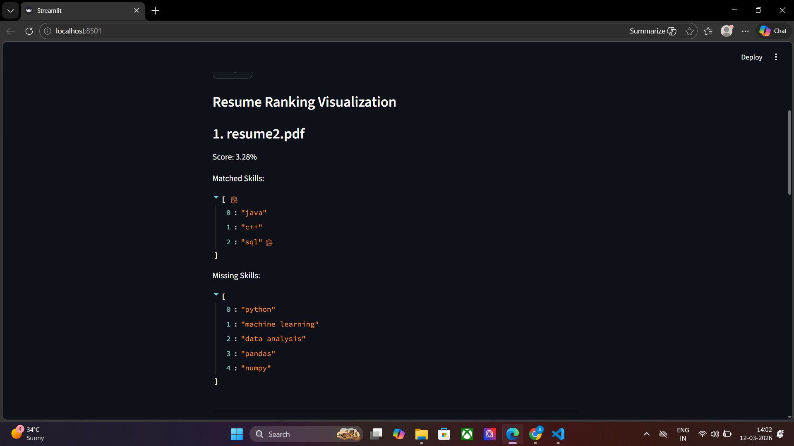
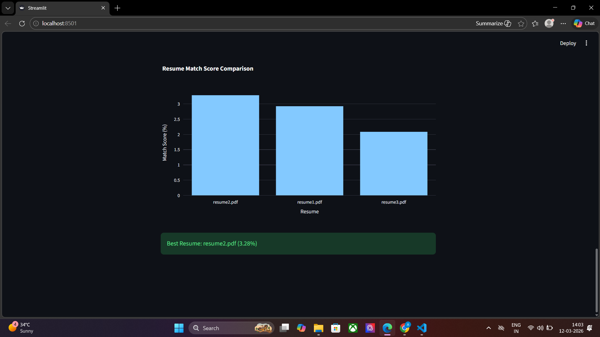

# AI Resume Ranker

An AI-powered application that ranks resumes based on a job description using NLP techniques.

## Features
- Upload multiple resumes (PDF)
- Enter job description
- Detect skills from resumes
- Rank resumes based on similarity score
- Visualize results using bar charts

## Technologies Used
- Python
- Streamlit
- Scikit-learn
- TF-IDF Vectorization
- Cosine Similarity
- PyPDF2

## How to Run

Install dependencies:

pip install -r requirements.txt

Run the app:

streamlit run app.py

## Project Demo

### Application Interface

### Resume Ranking Result

### Resume Ranking Result
.png)

### Resume Ranking Result
.png)

### Score Comparison Chart

